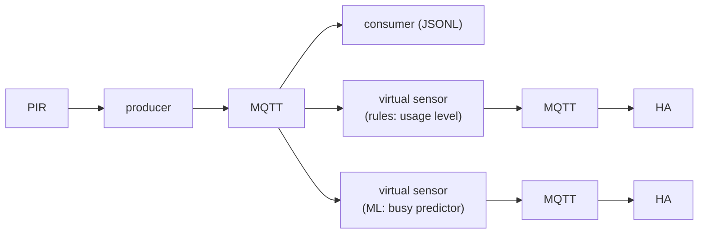
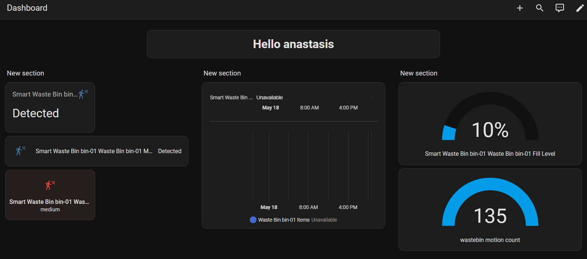
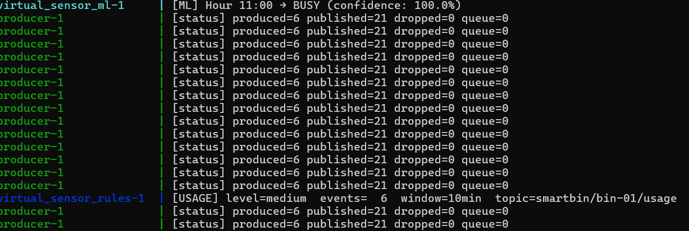

# Lab 09 — Data Processing on Edge Devices

**Student:** anastasis | 12345678

---

## Part A — Setup & Run

### Directory Structure

```
lab09/
├── README.md
├── requirements.txt
├── asyncapi.yml
├── docker-compose.yml
├── Dockerfile
├── mosquitto.conf
├── train_model.py
├── virtual_sensor_ml.py
├── virtual_sensor_rules.py
├── docs/
│   └── Ontology
├── models_v_s/
│   └── busy_predictor.joblib
├── models/
│   ├── context.jsonld
│   ├── environment.jsonld
│   ├── sensor.jsonld
│   └── wastebin.jsonld
└── src/
    ├── api.py
    ├── consumer.py
    ├── producer.py
    └── pirlib/
        ├── __init__.py
        ├── interpreter.py
        └── sampler.py```
``` 

### Run

**Start the MQTT broker, API, Producer and Consumer:**
```bash
docker compose up --build 
```


 
### Sensor Architecture


### Usage limits 

| Usage Level | Count Range | Code Condition | System Status |
| --- | --- | --- | --- |
| **Idle** | 0 | `count == 0` | Inactive / Standby |
| **Low** | 1 – 3 | `0 < count <= 3` | Light usage |
| **Medium** | 4 – 10 | `3 < count <= 10` | Moderate usage |
| **High** | 11+ | `count > 10` | Heavy usage / Peak load |
---

### Train the machine learning model 
```python 
python train_model.py 
``` 

### Classification results 
| Class / Metric | Precision | Recall | F1-Score | Support |
| :--- | :---: | :---: | :---: | :---: |
| **busy** | 0.84 | 0.94 | 0.89 | 34 |
| **quiet** | 0.98 | 0.95 | 0.96 | 110 |
| **accuracy** | — | — | 0.94 | 144 |
| **macro avg** | 0.91 | 0.94 | 0.93 | 144 |
| **weighted avg** | 0.95 | 0.94 | 0.95 | 144 |



## Part B

## Rule-based virtual sensor

**RQ1: What thresholds did you use for idle/low/medium/high? How did you decide on these values?**
We set 0for idle,3 for low,10 for medium and greater than 10 for high. Because of the size of our bin we decided to lower the thresholds.


**RQ2: What window size did you choose and why? What happens if you make it too short (e.g., 1 minute) or too long (e.g., 60 minutes)?**
We chose to set the window size at 10 minutes. If it is too short the ml will reach to a decision based on single events meaning we won't know the true usage intensity of the bin. Likewise if it is too long because of the extended size we will lost meaningful data like the peak hour.


**RQ3: How does the rolling window implementation (the deque) relate to what the lecture described as CEP windowed operators?**
A deque is the physical memory structure (a sliding window) that allows your system to perform Complex Event Processing (CEP) without running out of memory.


**RQ4: What would you need to change if you wanted to add a new level (e.g., “critical” for bins that might overflow)?**
We need to change thresholds in the virtual sensor rules file.For example we will limit high between 10 and 15 and set critical for greater than 15.

---

## ML virtual sensor

**RQ5: What features did you use for the classifier? Why these features?**
1.`hour`: At night bins are not used that often also bins by a cafeteria might be busier during launch hours.
2.`day_of_week`: In many settings, for example in a university, bins will be busier on weekdays.
3.`is_weekend`: This is another parameter to alert us if its the weekend to expect less busy usage.

**RQ6: Show the classification report from training. What is the accuracy? Which class (busy/quiet) is harder to predict?**
| Class    | Precision | Recall | F1-Score | Support |
|----------|------------|--------|-----------|---------|
| busy     | 0.84       | 0.94   | 0.89      | 34      |
| quiet    | 0.98       | 0.95   | 0.96      | 110     |
| accuracy |            |        | 0.94      | 144     |

The accuracy is 94% which is a very good result. We can see from the result that busy is harder to predict.

**RQ7: Why did we use a Random Forest classifier? Could you use a different model? What would change?**

Random Forest allows for many decision trees to vote together and it also handles non-linear patterns better than other models, but we could achieve a similar result with a different model.

**RQ8: The training data is synthetic. What would change if you used real motion data collected over several weeks? What patterns might emerge that the synthetic data misses?**

We are not able to predict event outliers such as a university event which would attract a lot of people or a public holiday which would render our bins less busy.

**RQ9: The model publishes a confidence score alongside the prediction. Why is this useful? What should a consumer do if confidence is low (e.g., 55%)?**

As predictions are binary for example `quiet` or `busy` there is always a degree of uncertainty within that prediction. A human intervention based on the prediction's confidence score is needed to achieve better results, it can point to the need of using a different model.

---

## Comparison

**RQ10: Give one scenario where the rule-based sensor and the ML sensor disagree. Which one would you trust more in that scenario, and why?**
During some special event, where the use of the bin is above the usual levels, the machine learning sensor would predict a much lower than actual value. The rule based sensor takes in the real data and is much more trustworthy. 

**RQ11: The rule-based sensor reacts to the present. The ML sensor predicts the future. Give one use case where each is more useful.**
If we desire to know the actual usage we are seeing on the bin so that we use that on a digital dashboard the rule based sensor is the ideal choise. If we want to predict future usage so that we schedule clean up trips, the machine learning sensor is the more viable choise. 

**RQ12: If motion patterns changed tomorrow (e.g., the bin was moved to a new location), which sensor would adapt first? What would you need to do for the other?**
The sensor that would change at once would be the rule based sensor. In order to fit the machine learning sensor to the new data, we would need to retrain it. 

---

## Architecture

**RQ13: You added two new processing components to your system without modifying the producer or consumer. How did the pub/sub architecture make this possible?**
The asychronous publisher subscriber architecture makes possible easy new component integration. The publishers that already existed don't need to know about the new components while the compomenets can use the data they produce freely. 

**RQ14: Both virtual sensors publish to MQTT. Could a third virtual sensor subscribe to their output and combine them? Give an example.**
A third sensor could subscribe to their output and compare them in order to give the accuracy of the machine learning sensor. In low accuracy situations it could send a warning that would alert a human handler of a needed model retrain. 

**RQ15: Show a screenshot with the raw motion sensor, usage intensity, and activity prediction all visible.** 


---

## Reflection

**RQ16: In the DIKW pyramid, where does the raw motion event sit? Where does the usage level sit? Where does the prediction sit? What moved the data up each level?**

Raw motion event sits at the Data level, GPIO pin goes HIGH, single MQTT pulse, all have no meaning.
Fill level (usage) sits at Information.
ML prediction sits at Knowledge.
What moved it up: Data became Information through aggregation and context and information became Knowledge through pattern learning and generalisation.
Information became Knowledge through pattern learning and generalisation.

**RQ17: In your own words, what is a virtual sensor? How does it differ from a physical sensor?**

A virtual sensor provides a level of translation or processing on information, oftentimes obtained by physical sensors, that makes it more legible by human operators or more useful for other applications.

**RQ18: If you had access to additional sensors (temperature, fill level, noise), what virtual sensor could you build by combining them? Describe the inputs, the logic, and the output.**

We would take into account fill level,noise, usage intensity and some visual inputs to determine if the space near the bins needs cleaning in case of an event like concert, local festival or charity events like marathons.

