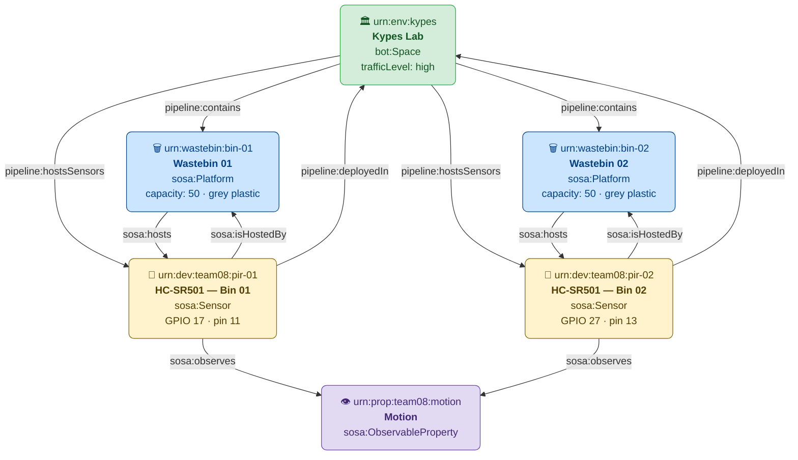

# Smart Wastebin System

> An IoT edge-computing pipeline that monitors bin occupancy via a PIR motion sensor,
> publishes structured JSON-LD events over MQTT, stores them in SQLite, classifies usage
> intensity with rule-based and ML virtual sensors, exposes a REST API with Swagger UI
> and AsyncAPI docs, utilises Node-RED for low-code integration, and surfaces all entities
> in Home Assistant — all launched with a single `docker compose up --build`.

**Team 08** · Advanced Programming Techniques · ECE Upatras · 2026

---

## Table of Contents

1. [Architecture Overview](#1-architecture-overview)
2. [Hardware & Wiring](#2-hardware--wiring)
3. [Prerequisites](#3-prerequisites)
4. [Quick Start](#4-quick-start)
5. [Directory Structure](#5-directory-structure)
6. [Services Reference](#6-services-reference)
7. [MQTT Topic Structure](#7-mqtt-topic-structure)
8. [REST API Endpoints](#8-rest-api-endpoints)
9. [SQLite Database](#9-sqlite-database)
10. [Node-RED Flows](#10-node-red-flows)
11. [Virtual Sensors](#11-virtual-sensors)
12. [Home Assistant Integration](#12-home-assistant-integration)
13. [Training Data Upload & Retraining](#13-training-data-upload--retraining)
14. [Cloudflare Tunnel (Remote Access)](#14-cloudflare-tunnel-remote-access)
15. [Configuration Reference](#15-configuration-reference)
16. [Extending the System (Multi-Bin)](#16-extending-the-system-multi-bin)
17. [Semantic Models](#17-semantic-models)
18. [Troubleshooting](#18-troubleshooting)

## 1. Architecture Overview

```
HC-SR501 PIR sensor
       │ GPIO BCM-17 (configurable via --pin)
       ▼
  producer.py ─────────────────────► Mosquitto MQTT broker :1883
       │                                        │
  sensor_state.json                             ├──► consumer.py 
  (persists fill level across reboots)          │     ├── motion_events.jsonl
                                                |     └── SQLite writer ──► smartbin.db
                                                ├──► virtual_sensor_rules.py  (CEP)
                                                │
                                                ├──► virtual_sensor_ml.py     (Random Forest)
                                                │
                                                ├──► Node-RED :1880
                                                │         ├── alert flows
                                                |         └── counter 
                                                │
                                                └──► api.py :5000 (Swagger UI)
                                                           ├── /bins/{id}/events
                                                           ├── /bins/{id}/usage
                                                           ├── /bins/{id}/usage/peak
                                                           ├── /bins/{id}/usage/least
                                                           ├── /bins/{id}/empty
                                                           ├── /sensors/...
                                                           ├── /mqtt/...
                                                           └── /ml/retrain  /ml/predict
                                                                     │
                                                           Home Assistant :8123
                                                                     │
                                                           Cloudflare Tunnel
                                                           ha / api / upload / asyncapi
                                                           .smart-wastebin.com
```

Data flows from the physical sensor through MQTT into both persistent storage (SQLite  and the API) and real-time analytics (virtual sensors). The REST API serves all stored data with a Swagger UI and can also publish commands back to MQTT (e.g. mark a bin
as emptied). Home Assistant auto-discovers all entities via MQTT Discovery.

---

## 2. Hardware & Wiring

### Components

| Component | Qty | Notes |
|---|---|---|
| Raspberry Pi 5  | 1 | Any model with 40-pin GPIO header |
| HC-SR501 PIR Motion Sensor | 1 | 5 V supply, 3.3 V output — Pi-compatible |
| Female-to-female jumper wires | 3 | VCC · GND · OUT |
| Waste bin (~18 cm height) | 1 | Sensor mounts on the inside back wall |

### GPIO Wiring

```
HC-SR501 Pin        Raspberry Pi (BCM)     Raspberry Pi Header Pin
──────────────────────────────────────────────────────────────────
VCC (power)   ──►   5 V                    Pin 2
GND (ground)  ──►   GND                    Pin 6
OUT (signal)  ──►   GPIO 17 (default)      Pin 11
```


### Physical Mounting

Mount the sensor on the **inner back wall** of the bin, lens facing the opening:

```
          ─ ─ ─ ─ ─ ─ ─ ─ ─ ─  ← bin lid
        |┌──────────────────┐|
        |│  HC-SR501 dome   │| ← screwed to the back wall
        |└────────┬─────────┘|
        |         │          |
        │                    │
        │        BIN         │
        │      interior      │
        │                    │
        └────────────────────┘
```


## 3. Prerequisites

### On the Raspberry Pi

| Requirement | Version | Check |
|---|---|---|
| OS | Raspberry Pi OS Lite (Bookworm 64-bit) recommended | `uname -a` |
| Docker Engine | ≥ 24 | `docker --version` |
| Docker Compose plugin | ≥ 2.20 | `docker compose version` |
| Git | any | `git --version` |

#### Install Docker on Raspberry Pi

```bash
curl -fsSL https://get.docker.com | sh
sudo usermod -aG docker $USER
newgrp docker              # apply group change without logout
docker run hello-world     # verify
```

#### Enable GPIO access (required for real hardware)

The `producer` container needs access to `/dev/gpiochip0`. Verify it exists:

```bash
ls /dev/gpiochip*
```

The `docker-compose.yml` passes the device through automatically. If you see a
`lgpio` error on a non-Pi machine, see [Troubleshooting](#17-troubleshooting).

### For Remote Access through port forwarding

- A Cloudflare account (free tier is sufficient)
- A domain registered with or transferred to Cloudflare (~$10/year)
- `cloudflared` CLI installed on the Pi (see [Section 14](#14-cloudflare-tunnel-remote-access))

---

## 4. Quick Start

```bash
# 1. Clone the repository
git clone https://github.com/manos-max/Smart-Waste-Bin.git
cd Smart-Waste-Bin

# 2. (Raspberry Pi only) Confirm GPIO device is accessible
ls /dev/gpiochip0

# 3. Build and start all services
docker compose up --build
```

Once the stack is running, services are reachable at:

| Service | URL |
|---|---|
| Swagger UI (REST API) | http://localhost:5000 |
| Upload & retraining UI | http://localhost:5001 |
| AsyncAPI docs | http://localhost:5002 |
| Node-RED editor | http://localhost:1880 |
| MQTT broker | localhost:1883 |
| Home Assistant | http://localhost:8123 |


---

## 5. Directory Structure
```
Smart-Waste-Bin/
│
├── docs/
│   └── Ontology                        # OWL/RDF ontology definition
│
├── ha-config/                          # Home Assistant configuration files
│
├── models/                             # JSON-LD semantic models
│   ├── context.jsonld                  # Shared @context for all models
│   ├── environment.jsonld              # Deployment environment description
│   ├── sensor.jsonld                   # PIR sensor instances
│   └── wastebin.jsonld                 # Smart waste bin instances
│
├── models_v_s/
│   └── busy_predictor.joblib           # Trained ML classifier (scikit-learn)
│
├── node-red/                           # Node-RED flow exports
│
├── src/
│   ├── models_v_s/                     # ML training artifacts 
│   ├── pirlib/                         # Shared PIR sensor helper library
│   └── pirlib/
│       ├── __init__.py
│       ├── interpreter.py        ← Debounce + cooldown logic
│       └── sampler.py            ← lgpio GPIO abstraction
│   ├── api.py                          # Flask-RESTX REST API (read + publish)
│   ├── consumer.py                     # MQTT consumer — DB ingest + JSONL writer
│   ├── database.py                     # SQLite schema, queries, helpers
│   ├── fictional_sensor.py             # Simulated sensor data generator
│   ├── producer.py                     # MQTT message producer
│   ├── serve_yaml.py                   # AsyncAPI spec HTTP server
│   ├── train_model.py                  # ML model training pipeline
│   ├── upload.py                       # File upload utility
│   ├── virtual_sensor_ml.py            # ML-based virtual sensor
│   └── virtual_sensor_rules.py        # Rule-based virtual sensor
│
├── .cloudflared.config.yml.example    # Cloudflare Tunnel config template
├── .dockerignore
├── .gitattributes
├── .gitignore
├── asyncapi.yml                        # AsyncAPI 2.x MQTT event specification
├── docker-compose.yml                  # Multi-service Docker orchestration
├── Dockerfile                          # Container image definition
├── mosquitto.conf                      # MQTT broker configuration
├── README.md
├── REPORT.tex                          # LaTeX project report
└── requirements.txt                    # Python dependencies
```
## 6. Services Reference

| Service | Image | Port | Entry point | Key volumes |
|---|---|---|---|---|
| `mosquitto` | `eclipse-mosquitto:2` | 1883 | — | `./mosquitto.conf` |
| `producer` | project build | — | `python producer.py` | `./data` |
| `consumer` | project build | — | `python consumer.py` | `./data` |
| `api` | project build | **5000** | `python api.py` | `./data`, `./models`, `./models_v_s` |
| `upload` | project build | **5001** | `python upload.py` | `./data`, `./models_v_s` |
| `asyncapi-docs` | project build | **5002** | `python serve_yaml.py` | `./asyncapi.yml` |
| `virtual_sensor_rules` | project build | — | `python virtual_sensor_rules.py` | — |
| `virtual_sensor_ml` | project build | — | `python virtual_sensor_ml.py` | `./models_v_s` |
| `node-red` | `nodered/node-red:latest` | **1880** | — | `./node-red:/data` |
| `homeassistant` | `homeassistant/home-assistant:stable` | **8123** | — | `./ha-config:/config` |

### Useful Docker Compose Commands

```bash
# Start all services (foreground — logs visible)
docker compose up --build

# Start in background
docker compose up --build -d

# Follow logs for one service
docker compose logs -f api

# Restart one service after a change
docker compose restart virtual_sensor_ml

# Stop all containers (data volumes preserved)
docker compose down

# Full reset including volumes (WARNING: deletes the database)
docker compose down -v
```

---

## 7. MQTT Topic Structure

All topics follow the pattern `smartbin/{bin_id}/{sensor_id}/...`.
The `bin_id` and `sensor_id` segments are configurable, enabling multi-bin deployments.

| Topic | Publisher | Payload | Retained | QoS |
|---|---|---|---|---|
| `smartbin/bin-01/pir-01/events` | producer | Full JSON-LD Observation | No | 1 |
| `smartbin/bin-01/pir-01/motion` | producer | `detected` \| `clear` | No | 1 |
| `smartbin/bin-01/fill-level/state` | producer | `0`–`100` | No | 1 |
| `smartbin/bin-01/pir-01/events/status` | producer | `online` \| `offline` (LWT) | Yes | 1 |
| `smartbin/bin-01/command` | api | `{action, emptied_at, emptied_by}` | No | 1 |
| `smartbin/bin-01/status` | api | `{state, emptied_at}` | Yes | 1 |
| `smartbin/bin-01/usage` | virtual_sensor_rules | `{usage_level, event_count, window_minutes}` | Yes | 1 |
| `smartbin/bin-01/prediction` | virtual_sensor_ml | `{prediction, confidence, predicted_hour}` | Yes | 1 |
| `smartbin/bin-01/alert` | node-red | `{type, fill_level, timestamp}` | Yes | 1 |
| `homeassistant/binary_sensor/bin-01_pir-01/config` | producer | HA Discovery JSON | Yes | 1 |
| `homeassistant/sensor/bin-01_fill/config` | producer | HA Discovery JSON | Yes | 1 |
| `homeassistant/sensor/bin-01_usage_level/config` | virtual_sensor_rules | HA Discovery JSON | Yes | 1 |
| `homeassistant/sensor/bin-01_motion_count/config` | virtual_sensor_rules | HA Discovery JSON | Yes | 1 |


---

## 8. REST API Endpoints

Interactive Swagger UI: `http://localhost:5000/`

### `/bins` Namespace

| Method | Path | Description |
|---|---|---|
| GET | `/bins/` | List all registered bins |
| GET | `/bins/{bin_id}` | Bin detail (name, location, status) |
| GET | `/bins/{bin_id}/events?limit=50` | Recent motion events (SQLite) |
| GET | `/bins/{bin_id}/usage` | Full weekly usage heatmap (7 days × 24 hours) |
| GET | `/bins/{bin_id}/usage/peak?day=0` | Peak hour for a given day-of-week |
| GET | `/bins/{bin_id}/usage/least?day=0` | Least-active hour for a given day-of-week |
| GET | `/bins/{bin_id}/usage/data` | Download usage as CSV for ML training |
| POST | `/bins/{bin_id}/empty` | Mark bin emptied — publishes MQTT command |
| GET | `/bins/{bin_id}/emptied-history?limit=20` | Emptying event history |

#### Example — peak-hour response

```json
{
  "bin_id": "bin-01",
  "day_of_week": 0,
  "hour": 12,
  "usage_count": 23,
  "label": "peak"
}
```

### `/sensors` Namespace

| Method | Path | Description |
|---|---|---|
| GET | `/sensors/` | List all sensors with mounted bin |
| GET | `/sensors/{sensor_id}` | Sensor detail (model, pin, mounted_on) |
| GET | `/sensors/{sensor_id}/events?limit=50` | Events for a specific sensor |

### `/mqtt` Namespace

| Method | Path | Description |
|---|---|---|
| POST | `/mqtt/publish` | Publish arbitrary message to any topic |
| GET | `/mqtt/messages?limit=100` | All stored MQTT messages from DB |
| GET | `/mqtt/messages/{bin_id}` | Stored messages filtered by bin |

### `/ml` Namespace

| Method | Path | Description |
|---|---|---|
| POST | `/ml/retrain` | Retrain the busy/quiet predictor from real DB data |
| GET | `/ml/predict` | Predict busy/quiet for the next hour |

---

## 9. SQLite Database

### Schema

The database is initialised automatically by `consumer.py` on first start and accessed on proceding program runs. 

### Database Backup

```bash
database_path : /data/smartbin.db 
```

---


## 10. Node-RED Flows

Node-RED runs at `http://localhost:1880`. The dashboard UI is at `http://localhost:1880/ui`.
All flows are version-controlled in `node-red/flows.json` and loaded automatically from the mounted volume.

## Installation instructions 
### Install node-red-dashboard
1. Open the Node-RED editor.
2. Click the menu icon (top-right) and select **Manage palette**.
3. Go to the **Install** tab.
4. Search exactly for `node-red-dashboard`.
5. Click **install**.

### Configure Mqtt 
1. For every node, double click 
2. On the server field -> pencil  
3. Replace the Server ip with the Pi5's ip 

### What the Flows Do

| Flow | Subscribes to | Logic | Publishes / Writes |
|---|---|---|---|
| **Motion router** | `smartbin/bin-01/pir-01/events` · `smartbin/bin-01/pir-01/motion` | `switch` node: routes `detected` → function 1, `clear` → cleared debug | — |
| **Rolling counter + classifier** | (internal, from switch) | `function 1`: 10-min deque per bin, classifies idle / low / medium / high | `smartbin/bin-01/usage/nodered` (retained) |
| **High-usage alert** | (internal, from function 1) | `highNotification` switch: fires when `level === "high"` → `POST_ALERT` function → HTTP POST to `api:5000/mqtt/publish` | `smartbin/bin-01/alerts` (retained) |
| **Event log** | (internal, from function 1) | File node: appends one line per event | `/app/data/detected_events.log` |
| **Dashboard gauge** | (internal, from function 1) | `ui_gauge`: displays event count 0–20, green/yellow/red segments | Dashboard at `/ui` |

### Dashboard

The Node-RED Dashboard (served at `http://localhost:1880/ui`) provides one live widget for `bin-01`:

- **Bin usage** — gauge showing events in the last 10 minutes.

---

## 11. Virtual Sensors

### Rule-Based (`virtual_sensor_rules.py`)

Subscribes to `smartbin/{bin_id}/{sensor_id}/events`. Maintains a `collections.deque`
as a rolling time window and evaluates usage level every 30 seconds (configurable).

| Level | Condition (events in window) |
|---|---|
| `idle` | count == 0 |
| `low` | 1 ≤ count ≤ 3 |
| `medium` | 4 ≤ count ≤ 10 |
| `high` | count > 10 |

Publishes to `smartbin/{bin_id}/usage` (retained, QoS 1) and auto-registers two
Home Assistant entities via MQTT Discovery.

**CLI arguments:**

```bash
python virtual_sensor_rules.py \
  --broker mosquitto \
  --port 1883 \
  --bin-id bin-01 \
  --subscribe-topic smartbin/bin-01/pir-01/events \
  --publish-topic smartbin/bin-01/usage \
  --window 10 \
  --interval 30
```

### ML-Based (`virtual_sensor_ml.py`)

Loads `models_v_s/busy_predictor.joblib` at startup.
Every 60 seconds (configurable), predicts whether the **next hour** will be `busy`
or `quiet`.

**Features used:** `day_of_week`, `hour`, `is_weekend`  
**Model:** `RandomForestClassifier` (50 estimators), trained at Docker build time via
`train_model.py`

Publishes to `smartbin/{bin_id}/prediction` (retained, QoS 1).

**CLI arguments:**

```bash
python virtual_sensor_ml.py \
  --broker mosquitto \
  --port 1883 \
  --bin-id bin-01 \
  --publish-topic smartbin/bin-01/prediction \
  --model-path models_v_s/busy_predictor.joblib \
  --interval 60
```

### Retraining the Model

**Option A — API endpoint (easiest):**
```bash
curl -X POST http://localhost:5000/ml/retrain
```
Falls back to synthetic data automatically if fewer than 50 real samples exist.

**Option B — Upload UI at http://localhost:5001:**  
```bash
# Download usage CSV for bin-01
curl http://localhost:5000/bins/bin-01/usage/data -o my_data.csv

# Upload the CSV 
Upload the csv `day_of_week,hour,is_weekend,event_count,label`
``` 

---

## 12. Home Assistant Integration

### Prerequisites

- Home Assistant instance (running locally via Docker or on the same network)
- MQTT Integration configured and pointing at the Pi's broker

### Setup Steps
#### Login page  
Create a new account with your own username and password. After connection you should be at the created 
dashboard for the 2 sensors.  

#### Configuration 
At this moment all sensors will be uknown as you haven't connected to the MQTT broker yet. 
1. Open Home Assistant → **Settings → Devices & Services → MQTT -> three dots -> reconfigure**
2. Set Broker to `<Raspberry Pi IP address>` and Port to `1883`
3. Click **Submit** — no username/password needed for the default config

All sensor entities should appear **automatically within ~30 seconds** via MQTT Discovery. If a sensor has been triggered but does not appear on your dashboard, the Entity ID in Home Assistant likely mismatched your dashboard configuration.

Follow these steps to cross-check and fix the entity names in case the above doesn't happen:

### Step 1: Find the Correct Entity ID
1. Navigate to **Settings** -> **Devices & Services** -> **MQTT**.
2. Click on **Entities** and search for your sensor (e.g., `pir-01 Motion`).
3. Left-click the entity, then click the **Settings (gear icon)** in the top-right corner.
4. Note down the exact **Entity ID** (e.g., `binary_sensor.smart_waste_bin_bin_01_waste_bin_bin_01_pir_01_motion`).

### Step 2: Verify and Fix the Dashboard
1. Go to your default Dashboard page.
2. Click the three dots in the top-right corner and select **Edit Dashboard**.
3. Locate the card or GUI element for the missing sensor and click **Edit**.
4. Cross-check the assigned entity name. Ensure it **exactly matches** the Entity ID you found in Step 1.
5. Save changes and refresh the page.

### Auto-Discovered Entities

| Entity ID | Type | State topic |
|---|---|---|
| `binary_sensor.waste_bin_bin01_motion` | Binary sensor | `smartbin/bin-01/pir-01/motion` |
| `sensor.waste_bin_bin01_fill_level` | Sensor (%) | `smartbin/bin-01/fill-level/state` |
| `sensor.waste_bin_bin01_usage_level` | Sensor (text) | `smartbin/bin-01/usage` |
| `sensor.waste_bin_bin01_motion_count` | Sensor (events) | `smartbin/bin-01/usage` |
| `sensor.waste_bin_bin01_prediction` | Sensor | `smartbin/bin-01/prediction` |
| `binary_sensor.waste_bin_bin01_alert` | Binary sensor | `smartbin/bin-01/alert` |

---

## 13. Training Data Upload & Retraining

The upload service runs at `http://localhost:5001`. It accepts CSV files, renders
visualisation charts, and can trigger a model retrain.

### CSV Format

```csv
day_of_week,hour,is_weekend,event_count,label
0,8,0,14,busy
0,9,0,22,busy
0,22,0,1,quiet
5,12,1,3,quiet
```

| Column | Type | Values |
|---|---|---|
| `day_of_week` | int | 0 (Mon) – 6 (Sun) |
| `hour` | int | 0–23 |
| `is_weekend` | int | 0 or 1 |
| `event_count` | int | ≥ 0 |
| `label` | string | `busy` or `quiet` |

The busy/quiet threshold is set in `train_model.py` as `BUSY_THRESHOLD` (default: 10
events per hour). Adjust this constant before retraining to match your environment.

### What the Upload Page Shows

After uploading, five Seaborn charts are rendered:
- **Class balance** — bar chart of busy vs quiet rows
- **Event count distribution** — KDE density per class
- **Mean events by hour** — weekday vs weekend line chart
- **Activity heatmap** — day-of-week × hour heatmap (YlOrRd palette)
- **Labels by day** — stacked bar chart per weekday

---

## 14. Cloudflare Tunnel (Remote Access)

Cloudflare Tunnel exposes your local services over HTTPS with **no open router ports**
and **no static IP** required. Four services are routed through sub-domains.

### Step 1 — Register a Domain

Cloudflare Dashboard → **Domain Registration** → Register or transfer your domain
(`yourdomain.com`). The domain must be managed by Cloudflare DNS.

### Step 2 — Install `cloudflared` on the Pi

```bash
curl -L https://pkg.cloudflare.com/cloudflare-main.gpg \
  | sudo tee /usr/share/keyrings/cloudflare-main.gpg > /dev/null

echo "deb [signed-by=/usr/share/keyrings/cloudflare-main.gpg] \
  https://pkg.cloudflare.com/cloudflare-workers-proxy focal main" \
  | sudo tee /etc/apt/sources.list.d/cloudflare-workers-proxy.list

sudo apt update && sudo apt install cloudflared -y
cloudflared --version   # verify
```

### Step 3 — Authenticate and Create the Tunnel

```bash
cloudflared tunnel login          # opens a browser login page
cloudflared tunnel create smartbin
# Note the UUID printed — you will need it in Step 4
```

### Step 4 — Write the Config File

Copy the example to the real config path and fill in your values:

```bash
cp .cloudflared/config.yml.example ~/.cloudflared/config.yml
```

```yaml
# ~/.cloudflared/config.yml  ← DO NOT COMMIT (credentials inside)
tunnel: <YOUR_TUNNEL_UUID>
credentials-file: /home/pi/.cloudflared/<YOUR_TUNNEL_UUID>.json

ingress:
  - hostname: ha.yourdomain.com
    service: http://localhost:8123
  - hostname: api.yourdomain.com
    service: http://localhost:5000
  - hostname: upload.yourdomain.com
    service: http://localhost:5001
  - hostname: asyncapi.yourdomain.com
    service: http://localhost:5002
  - service: http_status:404
```

> **Add or remove routes** by editing the `ingress` block. Each entry maps a sub-domain
> to a local port. You can expose Node-RED (`localhost:1880`) the same way, but consider
> enabling Node-RED password authentication first.

### Step 5 — Create DNS Records

```bash
cloudflared tunnel route dns smartbin ha.yourdomain.com
cloudflared tunnel route dns smartbin api.yourdomain.com
cloudflared tunnel route dns smartbin upload.yourdomain.com
cloudflared tunnel route dns smartbin asyncapi.yourdomain.com
```

Cloudflare creates CNAME records automatically. These propagate in seconds.

### Step 6 — Run as a System Service

```bash
sudo cloudflared service install
sudo systemctl enable cloudflared
sudo systemctl start cloudflared
systemctl status cloudflared        # confirm "active (running)"
```

The tunnel reconnects automatically on Pi reboots.

---

## 15. Configuration Reference

All parameters and their defaults. Values can be overridden via CLI flags inside
`docker-compose.yml` under the relevant service's `command:` key.

| Parameter | Default | CLI flag / env var | Service |
|---|---|---|---|
| MQTT broker host | `mosquitto` (Docker) / `localhost` (bare) | `--host` / `--broker` | producer, consumer, virtual sensors |
| MQTT broker port | `1883` | `--port` | all MQTT clients |
| PIR GPIO pin (BCM) | `17` | `--pin` | producer |
| Bin ID | `bin-01` | `--bin-id` | producer, virtual sensors |
| Sensor ID | `pir-01` | `--sensor-id` | producer |
| Device ID (URN) | `urn:dev:team08:pir-01` | `--device-id` | producer |
| Bin capacity (events = 100%) | `50` | `BIN_CAPACITY` constant in `producer.py` | producer |
| Sample interval (s) | `0.1` (10 Hz) | `--sample-interval` | producer |
| Cooldown between events (s) | `5.0` | `--cooldown` | producer |
| Minimum HIGH duration (s) | `0.5` | `--min-high` | producer |
| Event queue max size | `100` | `--queue-size` | producer |
| Producer run duration (s) | `7200` (2 h) | `--duration` | producer |
| MQTT topic (events) | `smartbin/bin-01/pir-01/events` | `--topic` | producer |
| Rolling window for rules (min) | `10` | `--window` | virtual_sensor_rules |
| Rules evaluation interval (s) | `30` | `--interval` | virtual_sensor_rules |
| Subscribe topic (rules) | `smartbin/bin-01/pir-01/events` | `--subscribe-topic` | virtual_sensor_rules |
| Publish topic (rules) | `smartbin/bin-01/usage` | `--publish-topic` | virtual_sensor_rules |
| ML model path | `models_v_s/busy_predictor.joblib` | `--model-path` | virtual_sensor_ml |
| ML prediction interval (s) | `60` | `--interval` | virtual_sensor_ml |
| Publish topic (ML) | `smartbin/bin-01/prediction` | `--publish-topic` | virtual_sensor_ml |
| Busy threshold (events/h) | `10` | `BUSY_THRESHOLD` in `train_model.py` | training |
| Fill alert threshold (%) | `80` | Node-RED switch node value | node-red |
| MQTT broker env (API) | `mosquitto` | `MQTT_BROKER` env var in `docker-compose.yml` | api |
| Database path | `smartbin.db` | `DBPATH` env var | api, database |

---

## 16. Extending the System (Multi-Bin)

The database schema is **fully multi-bin by design** — `PIR_Events`, `Bin_Usage`, and `MQTT_Messages` all use `bin_id` as a foreign key, and `upsert_bin()` / `upsert_sensor()` use `INSERT ... ON CONFLICT DO UPDATE` so new bins register themselves automatically the first time an event arrives. No schema migration is needed when adding bins.

### Add a Second Bin

Adding a second bin requires four changes:

**1. Add a second producer service** in `docker-compose.yml`:

```yaml
producer-bin-02:
  build: .
  command: >
    python3 producer.py
      --verbose
      --host mosquitto
      --bin-id bin-02
      --sensor-id pir-02
      --pin 27
  privileged: true
  devices:
    - /dev/gpiochip0:/dev/gpiochip0
  volumes:
    - ./data:/app/data
  networks:
    - smartbin-net
  depends_on:
    - mosquitto
```

**2. Add JSON-LD model files** for the new bin and sensor:

```bash
# Edit the model files :
wastebin.jsonld → @id: "urn:wastebin:bin-02", sosa:hosts: pir-02
sensor.jsonld   → @id: "urn:dev:team08:pir-02", gpioPin: 27, physicalPin: 13
# Also add "urn:wastebin:bin-02" to pipeline:contains in environment.jsonld
```

**3. Add a second virtual sensor rules service**:

```yaml
virtual_sensor_rules_bin02:
  build: .
  command: >
    python virtual_sensor_rules.py
      --broker mosquitto
      --bin-id bin-02
      --subscribe-topic smartbin/bin-02/pir-02/events
      --publish-topic smartbin/bin-02/usage
  networks:
    - smartbin-net
  depends_on:
    - mosquitto
    - producer-bin-02
```


***


## 17. Semantic Models



The `models/` directory contains four JSON-LD files that give every entity in the system a globally unique, dereferenceable identity using standard ontologies. These are not runtime config — they are machine-readable semantic descriptions consumed by the API's `_build_registries()` and served as Linked Data.

### Ontology Prefixes Used

| Prefix | Namespace | Purpose |
|---|---|---|
| `schema` | `https://schema.org/` | General-purpose names, descriptions, values |
| `bot` | `https://w3id.org/bot#` | Building topology (Space, Zone, Building) |
| `sosa` | `http://www.w3.org/ns/sosa/` | Sensor, Platform, Observation, ObservableProperty |
| `ssn` | `http://www.w3.org/ns/ssn/` | Sensor system properties |
| `ssn-system` | `http://www.w3.org/ns/ssn/systems/` | MeasurementRange, SystemCapability |
| `pipeline` | `…/docs/Ontology.md#` | Project-specific extensions (GPIO pin, fill level, traffic, etc.) |
| `xsd` | `http://www.w3.org/2001/XMLSchema#` | Typed literals (float, integer, date, string) |

***

### `models/environment.jsonld` — Deployment Space

Describes the physical room where the bins are deployed as a `bot:Space`.

```json
{
  "@id":   "urn:env:kypes",
  "@type": "bot:Space",
  "name":  "Kypes Lab",
  "pipeline:spatialHierarchy": {
    "campus": "University Campus", "building": "basiko",
    "floor": "0", "room": "Kypes Lab"
  },
  "pipeline:trafficLevel": "high",
  "pipeline:contains":      ["urn:wastebin:bin-01"],
  "pipeline:hostsSensors":  ["urn:dev:team08:pir-01"]
}
```

Key fields:

- **`pipeline:trafficLevel`** — `high` / `medium` / `low`. Informs about baseline expectation for the location.
- **`pipeline:contains`** — list of bin URNs physically present in this space. Add `"urn:wastebin:bin-02"` when deploying a second bin.
- **`pipeline:hostsSensors`** — list of sensor URNs mounted in this space.

***

### `models/sensor.jsonld` — Sensor Descriptions

Describes each HC-SR501 sensor as a `sosa:Sensor` with full hardware capabilities.

**Key properties for each sensor:**

| Property | `pir-01` (bin-01) | `pir-02` (bin-02) |
|---|---|---|
| `@id` | `urn:dev:team08:pir-01` | `urn:dev:team08:pir-02` |
| `pipeline:gpioPin` | **17** (BCM) | **27** (BCM) |
| `pipeline:physicalPin` | 11 | 13 |
| `pipeline:cooldownS` | 5.0 s | 5.0 s |
| `pipeline:sampleIntervalS` | 0.1 s (10 Hz) | 0.1 s |
| `pipeline:operatingMode` | `repeat-trigger` | `repeat-trigger` |
| `sosa:isHostedBy` | `urn:wastebin:bin-01` | `urn:wastebin:bin-02` |

The `ssn:hasProperty` array records physical hardware limits (detection range 0.5–7 m, angle 120°, supply 4.5–20 V, output 3.3 V) so the model is self-documenting without needing a datasheet.

> **Changing the GPIO pin** — update `pipeline:gpioPin` here **and** the `--pin` CLI arg in `docker-compose.yml` for the `producer` service. Both must match.

***

### `models/wastebin.jsonld` — Bin Platforms

Describes each bin as a `sosa:Platform` that hosts a sensor.

```json
{
  "@id":   "urn:wastebin:bin-01",
  "@type": "sosa:Platform",
  "pipeline:capacity":   50,
  "pipeline:heightCm":   18,
  "pipeline:diameterCm": 8,
  "pipeline:wasteType":  "general",
  "sosa:hosts": ["urn:dev:team08:pir-01"],
  "pipeline:locatedIn":  "urn:env:kypes"
}
```

`pipeline:capacity` (default: `50`) is the number of disposal events that represents 100% fill. The producer increments fill level relative to this value. Adjust it to match your actual bin size.

***

### `models/context.jsonld` — Shared Context

A standalone context document referenced by all other files so namespace declarations are not repeated. Import it with `"@context": ["./context.jsonld", { ... }]` in any new model file you create.

***

### Adding a New Bin

1. Add a new entry in `wastebin.jsonld` with `"@id": "urn:wastebin:bin-03"` and update `sosa:hosts`.
2. Add a new sensor entry in `sensor.jsonld` with `"@id": "urn:dev:team08:pir-03"` and the new `pipeline:gpioPin`.
3. Add the new URNs to `environment.jsonld` under `pipeline:contains` and `pipeline:hostsSensors`.
4. Start a new producer service in `docker-compose.yml`:
   ```yaml
   producer-bin03:
     build: .
     command: python3 producer.py --verbose --host mosquitto --bin-id bin-03 --sensor-id pir-03 --pin 22
   ```
5. The API's `_build_registries()` globs `models/wastebin*.jsonld` — all new bins are picked up automatically on next restart.

--- 

## 18. Troubleshooting


### Cloudflare Tunnel Shows "Offline"

```bash
sudo systemctl status cloudflared
sudo journalctl -u cloudflared -n 50
# Most common fix — re-authenticate:
cloudflared tunnel login
sudo systemctl restart cloudflared
```

### ML Model File Not Found at Startup

The model is built into the Docker image via `RUN python train_model.py`. If the
`models_v_s/` host volume mount overrides the baked model with an empty directory:

```bash
ls ./models_v_s/
# If empty, regenerate:
docker compose run --rm virtual_sensor_ml python train_model.py
docker compose restart virtual_sensor_ml
```

### Home Assistant Entities Not Appearing

- Confirm the MQTT integration is connected: **Settings → Devices & Services → MQTT**
- Check that the broker address points to the Pi's IP (not `localhost` from HA's perspective)
- Force a re-discovery by restarting the producer:
  ```bash
  docker compose restart producer
  ```
  Discovery payloads are published on every producer startup with `retain=True`.


## Team

Team 08 · Advanced Programming techniques  · ECE Upatras · 2025–2026
